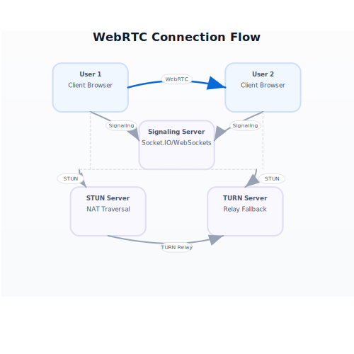

# MeetSync

A real-time video conferencing application using WebRTC and Socket.IO.

## Features

- Peer-to-peer video/audio communication
- Screen sharing
- Chat functionality
- Room-based meetings

## Tech Stack

- Frontend: React, TailwindCSS
- Backend: Node.js, Express
- Signaling: Socket.IO
- WebRTC: Peer-to-peer communication
- STUN/TURN: Google STUN, Metered TURN

## Environment Setup

### Backend (.env)
```env
FRONTEND_URL=https://newmeetingfinal.vercel.app/
PORT=5000
HOST=0.0.0.0
```

### Frontend (.env)
```env
VITE_HOST=dev
VITE_SOCKET_URL=https://video-call-app-yfcb.onrender.com
```

## Architecture



The application follows a standard WebRTC architecture:

1. **Signaling Server (Socket.IO)**
   - Handles room creation/joining
   - Exchanges WebRTC signaling data
   - Manages user presence

2. **STUN/TURN Servers**
   - STUN: Google's public STUN server
   - TURN: Metered TURN server for NAT traversal

3. **WebRTC Connection Flow**
   - ICE candidate gathering
   - Offer/Answer exchange
   - Peer connection establishment
   - Media stream exchange

## Development

```bash
# Backend
cd backend
npm install
node index.js

# Frontend
cd frontend
npm install
npm run dev
```

## Deployment

- Frontend: Vercel
- Backend: Render
- CI/CD: GitHub Actions (keeps server alive)

## 🛡️ Security

- HTTPS/WSS encryption
- CORS protection
- Secure WebRTC connections
- Environment variable protection

## 📱 Responsive Design

- Desktop-first approach
- Mobile-responsive layout
- Adaptive video grid
- Touch-friendly controls

## 🤝 Contributing

1. Fork the repository
2. Create your feature branch (`git checkout -b feature/AmazingFeature`)
3. Commit your changes (`git commit -m 'Add some AmazingFeature'`)
4. Push to the branch (`git push origin feature/AmazingFeature`)
5. Open a Pull Request

## 📄 License

This project is licensed under the MIT License - see the [LICENSE](LICENSE) file for details.

## 🙏 Acknowledgments

- WebRTC for peer-to-peer communication
- Socket.IO for real-time signaling
- Render for backend hosting
- Vercel for frontend deployment
- GitHub Actions for CI/CD

---
